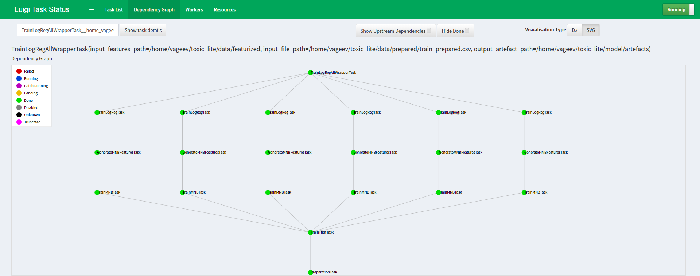

To run training and log models with ML Flow:

Create common network for model and tracking: `docker network create -d bridge toxic_net`

Make sure you run an ML Flow server, e.g. [https://github.com/La1c/mlflow_image](https://github.com/La1c/mlflow_image).

For example: 
1. `docker build -t mlflow_server https://github.com/La1c/mlflow_image.git`
2. `docker run -p 5000:5000 --name mlflow_container --network toxic_net -e DEFAULT_ARTIFACT_ROOT=s3://artifacts/ -e AWS_ACCESS_KEY_ID=ABC -e AWS_SECRET_ACCESS_KEY=DEF mlflow_server:latest`

***Clone this repo, copy .aws folder with credentials to its root.***

Build and run container with training scripts:

1. Build: `docker build -f Dockerfile_training -t toxic_classifier .`
2. Run the container. Make sure you mount a volume with train.csv and test.csv and pass AWS credentials, e.g.
`docker run -i -p 8082:8082 --network toxic_net --name model_container -v /path/to/toxic_data/:/toxic_comments/data toxic_classifier:latest train`

Luigi DAG:


Build and run container for online prediction:
1. Build image `docker build --network toxic_net --build-arg -f Dockerfile_online_predictor -t toxic_classifier_online .`
2. Run container `docker run -i -p 8070:8070 --network toxic_net --name online_predictor toxic_classifier_online:latest flask run --host=0.0.0.0`
3. Now you can send POST requests to localhost:8070/predict with the following body:
```
{
	"examples": [
        {"comment": "Some text"},
		{"comment": "Another comment"}
        ]
}
```
